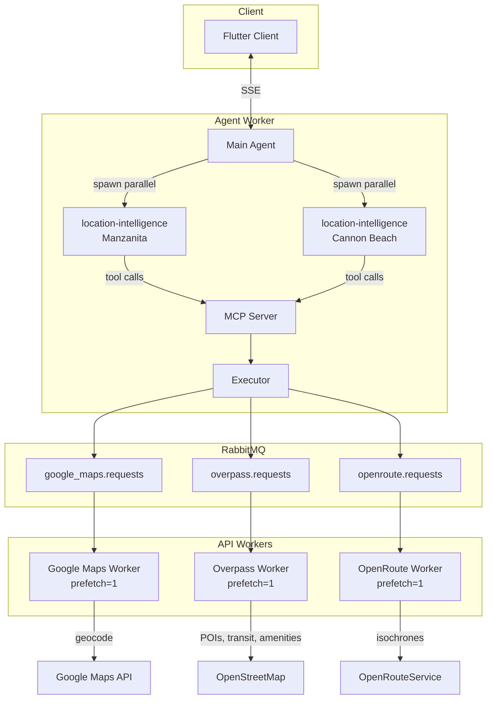

# Subagent Architecture

```mermaid
flowchart TB
    subgraph Client
        UI[Flutter Client]
    end

    subgraph "Agent Worker"
        MA[Main Agent]
        MA -->|spawn parallel| S1[location-intelligence<br/>Manzanita]
        MA -->|spawn parallel| S2[location-intelligence<br/>Cannon Beach]
        S1 & S2 -->|tool calls| MCP[MCP Server]
        MCP --> EX[Executor]
    end

    subgraph "RabbitMQ"
        Q1[google_maps.requests]
        Q2[overpass.requests]
        Q3[openroute.requests]
    end

    subgraph "API Workers"
        GW[Google Maps Worker<br/>prefetch=1]
        OW[Overpass Worker<br/>prefetch=1]
        ORW[OpenRoute Worker<br/>prefetch=1]
    end

    EX --> Q1 & Q2 & Q3
    Q1 --> GW
    Q2 --> OW
    Q3 --> ORW

    GW -->|geocode| GAPI[Google Maps API]
    OW -->|POIs, transit, amenities| OSM[OpenStreetMap]
    ORW -->|isochrones| ORS[OpenRouteService]

    UI <-->|SSE| MA
```
